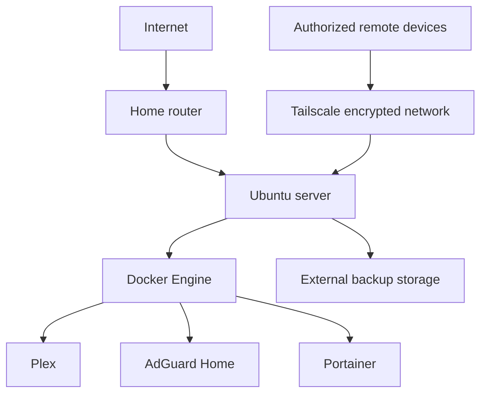

# Secure Ubuntu Homelab


This repository documents a 24/7 Ubuntu homelab built to develop practical
skills in Linux administration, Docker, network security, automation, secure
remote access, and recovery planning.

> Security note: Public documentation uses example addresses and sanitized
> configuration. Credentials, tokens, private IP addresses, device identifiers,
> claim codes, and personal data are never committed.

## Current architecture



## Implemented services

| Service | Purpose | Primary control |
| --- | --- | --- |
| Ubuntu | Bare-metal server platform | Regular patching and least privilege |
| Docker | Isolated application deployment | Persistent volumes and controlled ports |
| Plex | Personal media management | Authenticated access and restricted storage mounts |
| AdGuard Home | Network DNS filtering | Local network exposure and controlled administration |
| Portainer | Container administration | Strong authentication and private access |
| Tailscale | Remote administration | Identity-based encrypted connectivity |

## Security decisions

- Administrative services are reached through Tailscale instead of arbitrary
  public port forwarding.
- Application data is stored in persistent Docker volumes or explicit bind
  mounts so containers can be recreated safely.
- Backup media is kept on a different physical device from the Ubuntu system
  disk.
- Destructive automation starts with preview and confirmation controls.
- Secrets are excluded from Git through `.gitignore` and manual review.
- Future malware-analysis workloads will run in isolated virtual machines with
  no trusted LAN access.

## Projects demonstrated

### 1. Containerized service deployment

Deployed and maintained multiple services with Docker, persistent storage,
restart policies, and purpose-specific network exposure.

### 2. Secure remote administration

Configured Tailscale so approved devices can administer the server without
exposing SSH and management dashboards directly to the internet.

### 3. DNS filtering

Deployed AdGuard Home as a network DNS service and validated that client DNS
traffic reached the filtering server.

### 4. Gmail API automation

Developed a Python workflow using OAuth 2.0 and the Gmail API. The program
paginates through message results, categorizes unread mail by age, previews the
impact, and performs batched label modifications.

### 5. Migration backup planning

Created a Bash workflow that inventories the system, pauses containers for a
consistent data snapshot, backs up volumes and bind mounts, restarts services,
copies media, and generates SHA-256 checksums.

## Lessons learned

- Container deletion is harmless only when important state is stored outside
  the disposable container layer.
- A backup is not trustworthy until its contents and checksums are verified.
- DNS services require careful IP-address planning because every client depends
  on their availability.
- Private overlay networking simplifies remote administration while reducing
  exposure to unsolicited internet traffic.
- Automation that can delete data needs safe defaults and an explicit execution
  boundary.

## Roadmap

- [ ] Add a UPS and automatic graceful shutdown
- [ ] Configure automated security updates and alerting
- [ ] Add centralized monitoring and uptime dashboards
- [ ] Deploy an isolated Windows learning VM
- [ ] Add Wazuh or another SIEM for endpoint telemetry
- [ ] Create detection rules and document a simulated incident
- [ ] Test a full restore onto a clean virtual machine

## Repository map

```text
.
├── README.md
├── SECURITY.md
├── docs
│   ├── architecture.md
│   └── portfolio-talking-points.md
└── .gitignore
```

## Ethics

This environment is used only with systems and accounts I own or have explicit
authorization to test. Security experiments are designed to remain isolated
from third-party systems and production networks.

