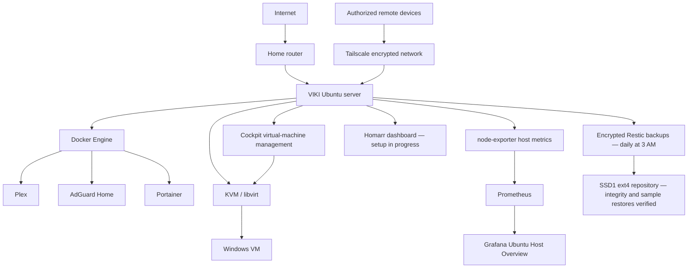

# VIKI — Secure Ubuntu Homelab


This repository documents a 24/7 Ubuntu homelab built to develop practical
skills in Linux administration, Docker, network security, automation, secure
remote access, and recovery planning.

> Security note: Public documentation uses example addresses and sanitized
> configuration. Credentials, tokens, private IP addresses, device identifiers,
> claim codes, and personal data are never committed.

## Current architecture


```mermaid
flowchart TD
    Internet --> Router["Home router"]
    Router --> Host["VIKI Ubuntu server"]
    Remote["Authorized remote devices"] --> TS["Tailscale encrypted network"]
    TS --> Host
    Host --> Docker["Docker Engine"]
    Docker --> Plex["Plex"]
    Docker --> AdGuard["AdGuard Home"]
    Docker --> Portainer["Portainer"]
    Host --> KVM["KVM / libvirt"]
    KVM --> Windows["Windows VM"]
    Host --> Cockpit["Cockpit virtual-machine management"]
    Cockpit --> KVM
    Host --> NE["node-exporter host metrics"]
    NE --> Prom["Prometheus"]
    Prom --> Grafana["Grafana Ubuntu Host Overview"]
    Host --> Homarr["Homarr dashboard — setup in progress"]
    Host --> Backup["Encrypted Restic backups — daily at 3 AM"]
    Backup --> SSD1["SSD1 ext4 repository — integrity and sample restores verified"]
```

## Implemented services

| Service | Purpose | Primary control |
| --- | --- | --- |
| Ubuntu | Bare-metal server platform | Regular patching and least privilege |
| Docker | Isolated application deployment | Persistent volumes and controlled ports |
| Plex | Personal media management | Authenticated access and restricted storage mounts |
| AdGuard Home | Network DNS filtering | Local network exposure and controlled administration |
| Portainer | Container administration | Strong authentication and private access |
| Tailscale | Remote administration | Identity-based encrypted connectivity |
| KVM / libvirt | Windows VM virtualization | VM lifecycle managed on Ubuntu |
| Cockpit / cockpit-machines | Browser-based VM management | Authenticated administrative access |
| node-exporter | Ubuntu host metrics | Host CPU, memory, filesystem, network, and uptime telemetry |
| Prometheus | Metrics collection and querying | Scrapes node-exporter for host monitoring |
| Grafana | Host monitoring dashboards | Working Ubuntu Host Overview dashboard |

## Security decisions

- Administrative services are reached through Tailscale instead of arbitrary
  public port forwarding.
- Application data is stored in persistent Docker volumes or explicit bind
  mounts so containers can be recreated safely.
- Backup media is kept on a different physical device from the Ubuntu system
  disk.
- Destructive automation starts with preview and confirmation controls.
- Secrets are excluded from Git through `.gitignore` and manual review.
- Future malware-analysis workloads will run in isolated virtual machines with
  no trusted LAN access.

## Projects demonstrated

### 1. Containerized service deployment

Deployed and maintained multiple services with Docker, persistent storage,
restart policies, and purpose-specific network exposure.

### 2. Secure remote administration

Configured Tailscale so approved devices can administer the server without
exposing SSH and management dashboards directly to the internet.

### 3. DNS filtering

Deployed AdGuard Home as a network DNS service and validated that client DNS
traffic reached the filtering server.

### 4. Gmail API automation

Developed a Python workflow using OAuth 2.0 and the Gmail API. The program
paginates through message results, categorizes unread mail by age, previews the
impact, and performs batched label modifications.

### 5. Windows virtualization with KVM and Cockpit

Installed KVM/libvirt and Cockpit with the virtual-machines extension on the
Ubuntu host, then created a Windows VM. This lets the host keep running its
Docker services while providing a separate Windows learning environment.
VM network isolation and guest configuration are still to be documented.

### 6. CPU clock troubleshooting and BIOS recovery

Investigated an Intel Core Ultra 5 250K Plus stuck near 400 MHz even under
load. Checked temperatures and CPU telemetry, then updated the Gigabyte
B860 DS3H WIFI6E rev. 1.0 BIOS with Q-Flash. A repeat load test showed
approximately 4.6–5.1 GHz at 100% busy. See
[the troubleshooting record](docs/cpu-bios-troubleshooting.md) for evidence
and steps.

### 7. Migration backup planning

Created a Bash workflow that inventories the system, pauses containers for a
consistent data snapshot, backs up volumes and bind mounts, restarts services,
copies media, and generates SHA-256 checksums.

### 8. Ubuntu host monitoring with Grafana and Prometheus

Deployed Grafana, Prometheus, and node-exporter through Docker and brought the
Ubuntu Host Overview dashboard online. The dashboard displays CPU usage,
memory, filesystem usage, network traffic, uptime, load, and exporter health.
Troubleshot initially blank dashboard panels until host metrics displayed.

This completes the initial host monitoring milestone. Service availability
probes, delivered alert notifications, centralized logs, and a simulated
security incident remain future work. See the
[monitoring and log-detection project](docs/grafana-monitoring-detection.md).

### 9. Homarr dashboard setup (in progress)

Installed Homarr to create a central dashboard for navigating the homelab's
services. Initial work has focused on account access and locating the existing
credential configuration while troubleshooting login.

The next milestone is to organize service links and validate integrations for
the lab's applications and monitoring tools. Installation is recorded as
progress; successful login, completed integrations, and dashboard coverage
remain to be verified. Credentials and credential files are excluded from
public documentation.

### 10. Verified encrypted daily SSD backups

Migrated the unfinished phone backup destination to SSD1 after identifying the
physical disk and partition, checking dependencies and capacity, obtaining
explicit erase confirmation, and completing an extended SMART test. The
existing main partition now uses ext4 and mounts at /mnt/viki-backup by UUID.
The existing systemd service and timer run daily at 03:00 America/Chicago.

The initial encrypted repository used approximately 32 GiB, leaving about
184 GiB available. Retention keeps 7 daily, 4 weekly, and 2 monthly snapshots
per backup group. Integrity checks read all repository data, and seven
representative restores matched their recorded hashes. A missing-disk test
proved that jobs refuse to write when the expected destination is absent.

Coverage includes application configuration, Compose files, persistent app
data, Home Assistant, personal files, and Windows VM storage and definitions.
Databases are captured while applications are stopped, with an additional
Immich PostgreSQL logical dump. VM disks are copied only while shut down.
The failing second drive remains excluded. SSD1 passed its extended test but
retains historical errors, so independent backup coverage remains important.

Server-side phone-transfer access was retired after SSD verification; removal
of the phone-side schedule is not confirmed. Previous backups are preserved
for potentially unique older files. This is local file/application backup,
not a bare-metal image or a complete 3-2-1 setup. Application recovery, VM boot
verification, and the first unattended SSD run remain to be tested.

See [the backup and recovery record](docs/viki-backup-recovery.md) for scope,
exclusions, restore instructions, and remaining work.

## Lessons learned

- Container deletion is harmless only when important state is stored outside
  the disposable container layer.
- A backup is not trustworthy until its contents and checksums are verified.
- DNS services require careful IP-address planning because every client depends
  on their availability.
- Private overlay networking simplifies remote administration while reducing
  exposure to unsolicited internet traffic.
- Automation that can delete data needs safe defaults and an explicit execution
  boundary.
- Check actual frequency under load before assuming a slow UI is caused by
  software; compare measurements before and after a firmware change.

## Roadmap

- [x] Complete an encrypted server backup and enable the daily systemd timer
- [x] Configure and validate the Windows QEMU guest agent
- [x] Diagnose the failing legacy HDD and exclude it from routine backups
- [x] Migrate the backup destination to SSD1 with an explicit disk erase confirmation
- [x] Verify full repository integrity and seven representative file restores
- [x] Validate missing-disk refusal and configure retention with pruning previews
- [x] Retire server-side phone-transfer access after SSD verification
- [ ] Observe the first unattended SSD backup and confirm phone-side schedule removal
- [ ] Preserve the password independently and review old phone backups for unique files
- [ ] Test full application recovery and a restored VM boot
- [ ] Monitor SSD1 health and establish another healthy independent backup
- [ ] Add a 1 TB NVMe as a parallel local backup destination
- [ ] Add an encrypted VIKI offsite copy in iCloud and verify restoration

- [x] Install Homarr for a central homelab dashboard
- [ ] Verify Homarr login and organize service links
- [ ] Configure and validate Homarr integrations

- [ ] Add a UPS and automatic graceful shutdown
- [ ] Configure automated security updates and alerting
- [x] Deploy Prometheus, node-exporter, and Grafana with a working Ubuntu host dashboard
- [ ] Extend monitoring to DNS/app availability and validate alert delivery ([project guide](docs/grafana-monitoring-detection.md))
- [ ] Add centralized logs and validate an SSH-failure detection exercise
- [ ] Configure automatic VM snapshot rotation
- [x] Create a Windows VM with KVM and Cockpit
- [ ] Document Windows VM networking and verify isolation before risky testing
- [ ] Add Wazuh or another SIEM for endpoint telemetry
- [ ] Create detection rules and document a simulated incident
- [ ] Test a full restore onto a clean virtual machine

## Repository map

```text
.
├── README.md
├── SECURITY.md
├── docs
│   ├── architecture.md
│   ├── viki-backup-recovery.md
│   ├── cpu-bios-troubleshooting.md
│   ├── grafana-monitoring-detection.md
│   └── portfolio-talking-points.md
└── .gitignore
```

## Ethics

This environment is used only with systems and accounts I own or have explicit
authorization to test. Security experiments are designed to remain isolated
from third-party systems and production networks.

