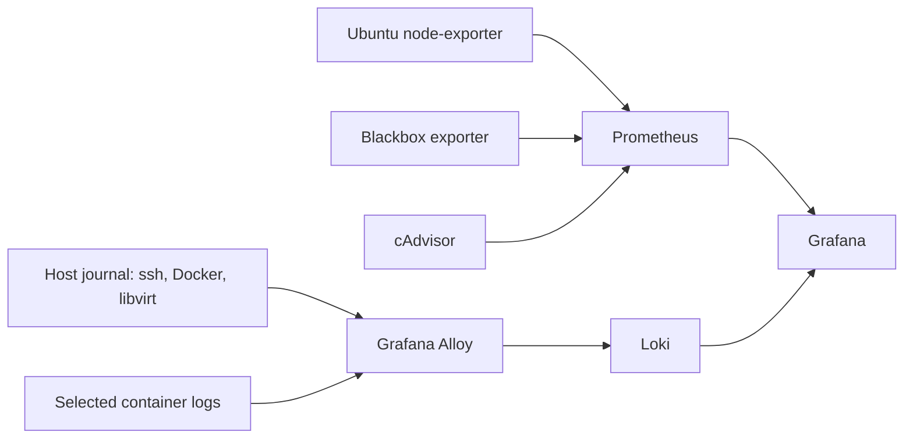

# Grafana monitoring and log-detection project

**Status:** Grafana, Prometheus, and node-exporter deployed in Docker; Ubuntu Host Overview dashboard working based on the completed lab setup. Service probes, centralized logs, alert delivery, and detection-exercise evidence remain pending.

## Completed host monitoring milestone

The Ubuntu Host Overview dashboard now displays CPU, memory, filesystem,
network, uptime, load, and exporter-health metrics from Prometheus and
node-exporter. Initially blank panels were troubleshot until metrics displayed.
This status records the completed lab setup; no live server inspection was
performed for this documentation update.

The host dashboard is complete as an initial milestone. Blackbox exporter,
cAdvisor, Loki, Alloy, notification delivery, and the simulated incident below
are planned extensions. Exact deployed versions, a sanitized dashboard export,
and a tested monitoring restore remain documentation follow-ups.

## Goal and scope

Build a free, local dashboard and a small detection workflow on the Ubuntu host. Keep household DNS, Plex, Portainer, KVM, and remote access observable without claiming a full SIEM deployment. The existing Grafana, Prometheus, and node-exporter containers provide working Ubuntu host monitoring. Reuse this stack when adding service probes and log collection.



Run Grafana OSS, Prometheus, Loki, Grafana Alloy, node-exporter, Blackbox exporter and, only if container resource panels are wanted, cAdvisor. Grafana is the single dashboard and alert interface. Prometheus stores numeric metrics, Loki stores selected logs, Alloy collects logs, and Blackbox exporter performs synthetic availability probes. Do not add Wazuh initially: a second telemetry pipeline would raise operational cost before these basic alerts and an investigation are proven. Revisit Wazuh later for endpoint inventory, integrity monitoring, and richer security correlation.

Use the existing Docker deployment pattern and persistent volumes. Bind management UIs to localhost or a private/Tailscale interface; do not publish Prometheus, Loki, exporters, or Grafana to the public internet. Restrict Loki and Prometheus to the Docker monitoring network. Give log collectors only the minimum read permissions needed. Avoid a general Docker socket mount; if Docker discovery needs one, use a narrowly configured socket proxy. Prefer explicit, named targets at first.

## Data sources and initial panels

| Source | Collect | First Grafana panel or question |
| --- | --- | --- |
| Ubuntu node-exporter | CPU busy, available memory, filesystem free space, disk activity, host uptime | Is the host under pressure or nearly full? |
| Prometheus self-metrics | `up`, scrape failures, rule evaluation | Is the monitoring pipeline healthy? |
| Blackbox exporter | DNS query to AdGuard and HTTP checks for selected management/app endpoints from the monitoring network | Can a client actually use DNS and reach an app? |
| cAdvisor (optional) | Per-container CPU, memory, restart-related visibility where supported | Which container is consuming resources? |
| Ubuntu systemd journal via Alloy | `ssh.service` or `sshd.service`, `docker.service`, `libvirtd.service` or active modular libvirt units | What happened at the time of an outage? |
| Selected Docker logs via Alloy | AdGuard, Portainer, Plex, and monitoring services, after inspecting log volume and sensitive fields | Which service errored or restarted? |
| libvirt via `virsh` or Cockpit | VM running/stopped state; start with a manual check, then add a small read-only exporter/script if useful | Is the Windows VM in its expected state? |
| Tailscale | Local service journal and `tailscale status`; access events may require an account/admin audit source | Did the agent disconnect? Do we have enough evidence to attribute remote activity? |

DNS query logs and application logs can contain private browsing, device, and account information. Do not ingest full AdGuard query histories, Plex viewing data, credentials, or Tailscale identity details by default. Set Prometheus retention to 15 days and start Loki with 7 days of retention **only after confirming the chosen Loki storage configuration enforces it**. Keep log streams and labels small; never use IP address, username, domain, or query text as high-cardinality Loki labels. Store real alerts and evidence privately; publish sanitized screenshots and event counts only.

The dashboard should have three rows: **host health** (CPU, RAM, disk, uptime), **service availability** (DNS probe, endpoint probes, Prometheus target status), and **security triage** (SSH failures over time, recent auth events, Docker/libvirt errors). Add an annotation at exercise time and link alert panels to Loki Explore queries.

## First alerts

Configure a Grafana contact point that you actually control, then use its test action and confirm delivery. Start with these rules; adjust thresholds after a week of normal observations.

| Alert | Starting condition | Evaluation | Action |
| --- | --- | --- | --- |
| AdGuard DNS unavailable | Blackbox DNS probe fails | 2 minutes | Check container health and resolver configuration; restore DNS before troubleshooting dashboards. |
| Critical app unavailable | Portainer or Plex HTTP probe fails | 5 minutes | Check `docker ps`, service logs, and host pressure. Probe application-specific routes; an HTTP status alone may not prove login works. |
| Host disk low | Filesystem available under 15%, excluding virtual/pseudo filesystems | 10 minutes | Check volume growth and backups before deleting anything. |
| Exporter/collector missing | Prometheus `up == 0` for node-exporter or Blackbox exporter | 5 minutes | Treat as a visibility failure; inspect the monitoring stack itself. |
| SSH authentication failures | 5 or more failed-password/invalid-user events within 5 minutes from the host auth journal | 1 minute | Inspect source, timing, successful logins, and Tailscale context; determine whether expected lab testing explains it. |

For the SSH rule, normalize journal records into a low-cardinality `job="host-auth"` Loki stream. Confirm the exact sshd message format on this host before choosing a LogQL filter. A starting Grafana Loki query is:

```logql
sum(count_over_time({job="host-auth"} |~ "(Failed password|Invalid user)" [5m]))
```

Set the rule to fire at **>= 5**; the expression alone returns a count. Scope it to the SSH unit during Alloy collection, and validate with actual received log lines. This is a lab detection for repeated failures, not proof of an intrusion. Where a query returns no series, deliberately configure Grafana's No Data behavior rather than assuming zero failures. Separate a missing-log-stream alert if feasible.

## Safe simulated incident

1. First verify that Grafana can query current host auth logs and that the alert contact point works. Record a baseline timestamp and recent failure count.
2. From **one device you own**, over the existing trusted LAN or Tailscale path, attempt five invalid SSH logins to the homelab within five minutes. Use a nonexistent test username and type an incorrect password interactively. Do not change SSH server settings or run an automated password attack. If the server only allows key authentication and logs do not show these attempts, use a clearly labeled synthetic test log in an isolated stream to validate the alert pipeline; do not report that as real SSH telemetry.
3. Confirm the journal received the events, Alloy shipped them to Loki, Grafana's query count rose, and the alert changed to firing. Confirm a notification arrived; record timestamps, event count, and any delivery delay.
4. Investigate the time range in Grafana Explore: correlate host SSH failures, any successful session, Docker or host health, and local Tailscale state. A missing Tailscale audit source limits conclusions about which remote identity initiated activity.
5. Stop the attempts. Let the five-minute window expire and verify the alert resolves. Record a short incident timeline, hypothesis, evidence, disposition ("authorized simulation"), and one improvement, such as a clearer runbook or adjusted threshold.

Do not disconnect household DNS, restart services, or place a malware VM on the trusted network for this exercise.

## Completion evidence and portfolio value

- Export or screenshot a sanitized dashboard showing host, DNS, and app probes; record a short baseline and one verified outage or safe test probe failure.
- Save the alert definition, query, test notification result, and the simulated incident timeline with private details removed.
- Record actual software versions, container/volume layout, and a tested restore path for Grafana, Prometheus, and Loki configuration/data.
- Track milestones separately: the working host dashboard is complete; service availability, delivered alerts, and the detection exercise require their own evidence before being marked complete. Call the project **centralized monitoring and log detection**; reserve **SIEM deployed** for a later, actually verified SIEM implementation.

**Operational follow-up:** Set up automatic snapshot rotation for the Windows/lab VMs once the backup and recovery plan is verified. The user requested a reminder at the next homelab project.

## References

- [Prometheus node-exporter guide](https://prometheus.io/docs/guides/node-exporter/)
- [Prometheus cAdvisor guide](https://prometheus.io/docs/guides/cadvisor/)
- [Grafana alert rules](https://grafana.com/docs/grafana/latest/alerting/alerting-rules/create-grafana-managed-rule/)
- [Grafana notification configuration](https://grafana.com/docs/grafana/latest/alerting/configure-notifications/)
- [Grafana Alloy documentation](https://grafana.com/docs/alloy/latest/)
- [Grafana Loki documentation](https://grafana.com/docs/loki/latest/)
